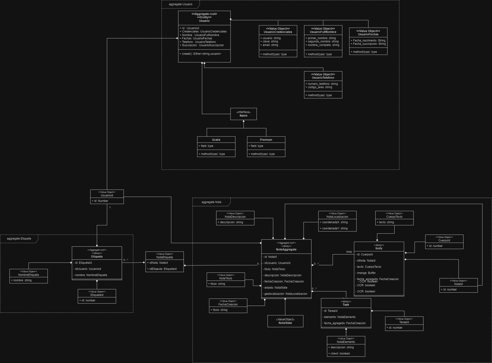
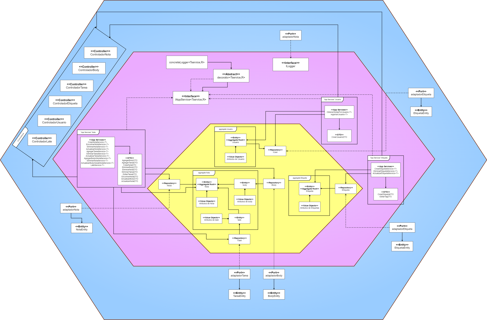

<p align="center">
  
</p>

## _NoteApp-Backend_

Backend de la applicación _NoteApp_ desarrollada por Clean Coders Naranja, utilizando NestJs.

## Instalación


Instalar dependencias de node a través del manejador de paquetes _npm_.

```bash
#npm dependencies
$ npm install
```

Copiar y crear el archivo .env para el manejo de las variables de entorno.

```bash
#.env.example configuration
$ cp .env.template .env
```

## Run de la APP

Ejecutar los siguientes comando para correr la aplicación.

```bash
# development
$ npm run start
```

```bash
# watch mode
$ npm run start:dev
```

```bash
# production mode
$ npm run start:prod
```

## Running Tests

```bash
# Test
$ npm run test
```

## Documentation

Modelo de Dominio.



<br/>

Arquitectura Hexagonal.



<br/>

## Desarrolladores

Algunos de los aportes de nuestros participantes en este repositorio y el repositorio de [mobile](https://github.com/omarlopezoficial/NoteApp-Frontend) son: 

### Andres Hurtado


| Actividades                      | Rama            |
|----------------------------------|----------------:|
| Persistencia | [CLEAN-47](https://github.com/omarlopezoficial/NoteApp-Frontend/) |
| OCR desde dentro de una nota | [CLEAN-11](https://github.com/omarlopezoficial/NoteApp-Frontend/) |
| Geolocalizacion | [CLEAN-26](https://github.com/omarlopezoficial/NoteApp-Frontend/) |

### Asdrubal Asensio

| Actividades                      | Rama            |
|----------------------------------|----------------:|
| Añadir Geolocalización | [CLEAN-46](https://github.com/omarlopezoficial/NoteApp-Backend/develop) |
| Editar Body | [CLEAN-86](https://github.com/omarlopezoficial/NoteApp-Backend/develop) |
| Eliminar Nota en Cascada | [CLEAN-102](https://github.com/omarlopezoficial/NoteApp-Backend/develop) |
| Eliminar Body | [CLEAN-103](https://github.com/omarlopezoficial/NoteApp-Backend/develop) |
| Obtener toda la info de una nota | [CLEAN-104](https://github.com/omarlopezoficial/NoteApp-Backend/develop) |

### Ashly Colmenares

| Actividades                      | Rama            |
|----------------------------------|----------------:|
| Añadir GPS | [CLEAN-110](https://github.com/omarlopezoficial/NoteApp-Frontend/) |
| Vista de Login y Registro | [CLEAN-11](https://github.com/omarlopezoficial/NoteApp-Frontend/) |
| Alertas | [CLEAN-109](https://github.com/omarlopezoficial/NoteApp-Frontend/) |
| Vista de Proceso de Pago | [CLEAN-55](https://github.com/omarlopezoficial/NoteApp-Frontend/) |

### Carlos Morón

| Actividades                      | Rama            |
|----------------------------------|----------------:|
|  Creación de Nota | [CLEAN-59](https://github.com/omarlopezoficial/NoteApp-Backend/tree/CLEAN-59-Creacion-de-nota-Backend)|
|  Añadir Tareas a una Nota | [CLEAN-50](https://github.com/omarlopezoficial/NoteApp-Backend/tree/develop)|
|  Loggs de Auditoria | [CLEAN-111](https://github.com/omarlopezoficial/NoteApp-Backend/tree/develop)|

### Javier Rojas

| Actividades                      | Rama            |
|----------------------------------|----------------:|
| Listado de Notas por Usuario | [CLEAN-23](https://github.com/omarlopezoficial/NoteApp-Backend/tree/feature/ListadoDeNotas) |
|Etiquetas|[CLEAN-51](https://github.com/omarlopezoficial/NoteApp-Backend/tree/feature/etiquetas)|
|Registro de Usuario|[CLEAN-68](https://github.com/omarlopezoficial/NoteApp-Backend/tree/CLEAN-92-Backend-Feature-Usuario)|
|Usuario Premiun y Gratis|[CLEAN-107](https://github.com/omarlopezoficial/NoteApp-Backend/tree/CLEAN-107-Feature/usuario-premiun-gratis)|
|Test Usuario Agregado|[CLEAN-117](https://github.com/omarlopezoficial/NoteApp-Backend/tree/develop)|


### Omar Lopez

| Actividades                      | Rama            |
|----------------------------------|----------------:|
| Vistas Free y Premium | [CLEAN-47](https://github.com/omarlopezoficial/NoteApp-Frontend/) |
| Fix Cargas Notas | [CLEAN-11](https://github.com/omarlopezoficial/NoteApp-Frontend/) |
| Vista Información de Notas | [CLEAN-26](https://github.com/omarlopezoficial/NoteApp-Frontend/) |

## License

NoteApp-Backend is [MIT licensed](LICENSE)


## Extras

### Libraries

- [Nest](https://nestjs.com/)
- [Jest](https://jestjs.io/)

### Guides
